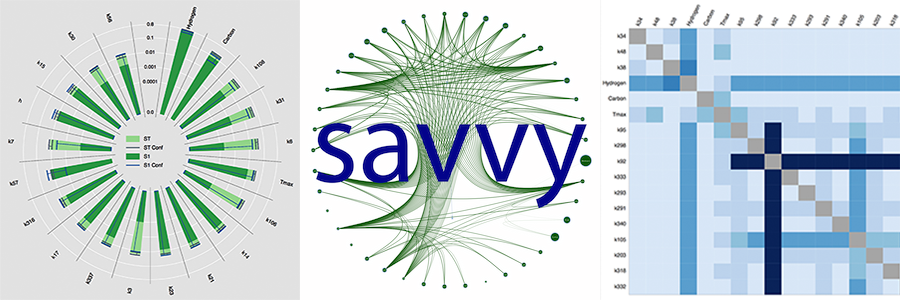

### Sensitivity Analysis Visualization Toolkit (savvy)                             
----

----
Do you savvy your sensitivity analysis results?  savvy is a data visualization toolkit that provides interactive visualizations of the results from high dimensionality global sensitivity analyses.  Users can visualize Sobol sensitivity analysis results generated by [SALib](https://github.com/SALib/SALib), or any data with the same structure (see the sample SALib output in the folder `/savvy/sample_data_files/` for this structure).  

For information on sensitivity analysis please see the SALib documentation.

savvy was written to visualize the total, first order, and second order sensitivities of 30 outputs from a lignin pyrolysis model with 410 parameters *(link to the lignin pyrolysis model will be added when that project is published)*.  Consequently, some functionality is specific to our model and is noted as such in relevant docstrings, but overriding the default arguments in these functions allows users to use any SALib output data from SALib.analyze.sobol.

**Documentation:** [ReadTheDocs](http://savvy.readthedocs.org)  
**Cite savvy:** [](https://zenodo.org/badge/latestdoi/21004/houghb/savvy)


----
### Quick Start
For the quickest introduction to savvy, run the file [`savvy_driver.ipynb`](http://nbviewer.jupyter.org/github/houghb/savvy/blob/master/savvy_driver.ipynb) in a Jupyter notebook.

Alternatively, install savvy using setup.py (see the documentation for details), then run the following in a Jupyter notebook.  The Jupyter notebook is required for interactive widgets to work, but the core plotting functionality can also be run from the command line and Bokeh will generate html figures if preferred (see the Bokeh documentation for instructions).
```python
import copy

from bokeh.plotting import show, output_notebook
import os.path as op

import savvy
import savvy.data_processing as dp
import savvy.interactive_plots as ip
from savvy.plotting import make_plot, make_second_order_heatmap
import savvy.network_tools as nt

output_notebook()

# path to sample data files
path = op.join(savvy.__path__[0], 'sample_data_files/')

# process the data files and store their pandas dataframes in a dictionary
sa_dict = dp.get_sa_data(path)

# create interactive radial plots (or bar charts if few features) for ST and S1
ip.interact_with_plot_all_outputs(sa_dict)

# Plot heat maps of S2 indices for all your analysis files
ip.plot_all_second_order(sa_dict, top=5, mirror=True)

# Display a network plot of the second order interactions
# with first or total order sensitivity indices
# (set inline to false for an interactive window)
sa_dict_net = copy.deepcopy(sa_dict)
g = nt.build_graph(sa_dict_net['sample-output1'], sens='ST', top=40,
                   min_sens=0.01, edge_cutoff=0.0)
nt.plot_network_circle(g, inline=True)
```
---
### Software dependencies and license information

**All the required software is open source.**  The implementation was done using the following language and packages.  

**Programming language:**   
Python version 2.7  ([https://www.python.org/](https://www.python.org/))

**Python packages needed:**
- NumPy 1.10.4
- pandas 0.18.0
- Bokeh 0.11.1
- matplotlib 1.5.1
- ipywidgets 4.1.1
- Jupyter 1.0.0
- SALib 0.7.1 (To perform sensitivity analysis)
- graph-tool 2.12 (To generate network plots)**

  \*\*not included in requirements.txt (see [documentation](http://savvy.readthedocs.org))

**License information:**   
savvy is licensed under a BSD 2-clause “Simplified” License. The objective behind this choice of licensing is to make the content reproducible and make it useful for as many people as possible. We want to maximize the two-way collaborations with minimum restrictions, so that developers of other projects can easily utilize, patch, improve, and cite this code.
For detailed description of the contents of license please refer to [License](https://github.com/houghb/savvy/blob/master/LICENSE)

----
### Summary of Folder Contents

**[savvy_driver.ipynb](https://github.com/houghb/savvy/blob/master/savvy_driver.ipynb)** - This is a Jupyter Notebook that is the driver for this package and can be used to create the interactive plots.

**[doc](https://github.com/houghb/savvy/tree/master/doc)** - Contains the project documentation files that are used to build the documentation at readthedocs.org.

**[doc/images](https://github.com/houghb/savvy/tree/master/doc/images)** - Contains images of sample plots and the package structure.

**[savvy](https://github.com/houghb/savvy/tree/master/savvy)** - Contains modules to visualize and generate the sensitivity analysis results.

-  `sensitivity_tools.py`: A wrapper of some SALib functions that can be used to generate sensitivity analysis results on your own models for visualizing in savvy.
- `data_processing.py`: Reads, cleans, and reformats the results.
- `plotting.py`: Plots 1st and total order sensitivity data as a radial plot and 2nd order data as a heat map.
- `interactive_plots.py`: Allows for user interaction with the plots created in `plotting.py`.
- `network_tools.py`: Creates a graph of the sensitivity data and displays it, but requires graph-tool which may not be available to all users.

**[savvy/tests](https://github.com/houghb/savvy/tree/master/savvy/tests)** -  Contains unit tests for each of the modules.

**[savvy/sample_data_files](https://github.com/houghb/savvy/tree/master/savvy/sample_data_files)** - Contains sample sensitivity analysis results from a Sobol sensitivity analysis using SALib that are used for unit testing and for demonstrating the package features.

----
### Directory structure
The package is organized as follows:
```
savvy Home (master)
|     .gitignore
|     LICENSE
|     README.md
|     requirements.txt
|     rtdrequirements.txt
|     savvy_driver.ipynb
|     setup.py
|  
|----- doc
|     |      Makefile
|     |      conf.py
|     |      getting-started.rst
|     |      index.rst
|     |      make.bat
|     |      module-docstrings.rst
|     |      requirements.rst
|     |          
|     |----- images
|     |      |    Network_graph.png
|     |      |    radial_plot.png
|     |      |    savvy_diagram.png
|     |      |    savvy_logo.png
|     |      |    savvy_logo_panel.png
|     |      |    second_order_plot.png
|     |
|----- savvy
|     |   __init__.py
|     |   data_processing.py
|     |   interactive_plots.py
|     |   network_tools.py
|     |   plotting.py
|     |   sensitivity_tools.py
|     |
|     |----- tests
|     |      |    __init__.py
|     |      |    README.md
|     |      |    interactive_plots_unittests.ipynb
|     |      |    test_data_processing.py
|     |      |    test_network_tools.py
|     |      |    test_plotting.py
|     |      |    test_sensitivity_tools.py
|     |
|     |----- sample_data_files
|     |      |    README.md
|     |      |    analysis_sample-output1.txt
|     |      |    analysis_sample-output2.txt
|     |      |    unittest_comparisons.pkl
|     |
|     |      |----- without_second_order_indices
|     |      |     |    analysis_sample-output3-no_second_order.txt
```
