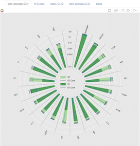
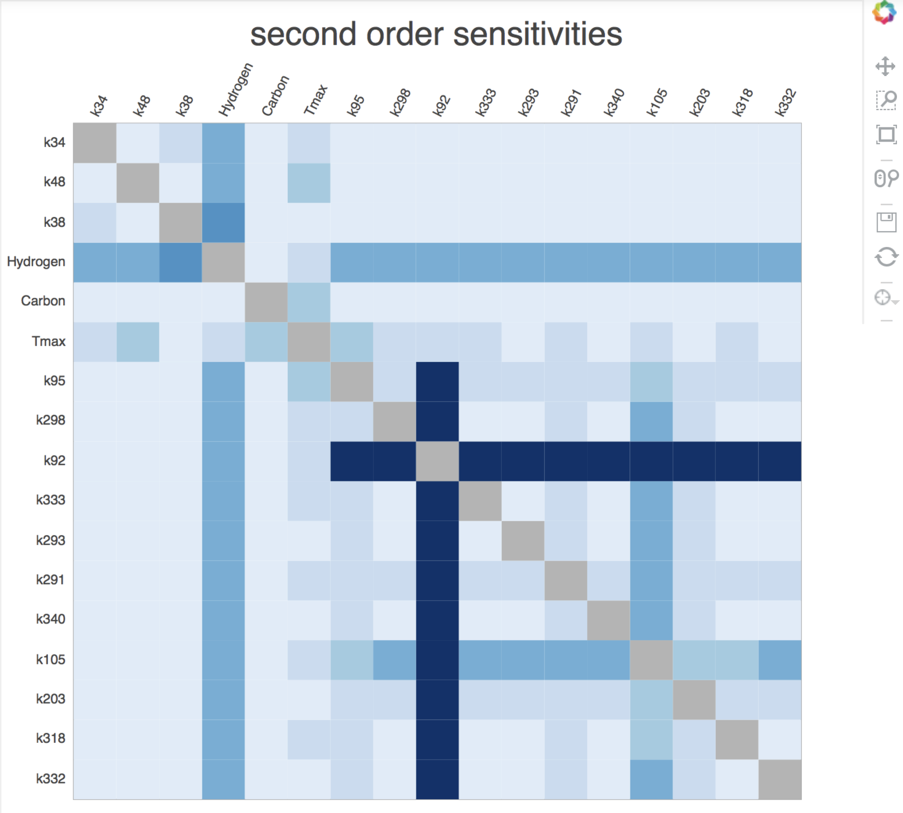

**************************
Getting Started With savvy
**************************

================
Installing savvy
================

Clone the github repo: https://github.com/houghb/savvy.git

In command line, enter the the savvy repo and run the command:

``python setup.py install``

This will install savvy on your machine so it can be called anywhere.

============================
Installing required packages
============================

In command line, enter the the savvy repo and run the command:

``pip install -r requirements.txt``

This will install the following packges required to run savvy:

* NumPy 1.10.4
* pandas 0.18.0
* Bokeh 0.11.1
* matplotlib 1.5.1
* ipywidgets 4.1.1
* Jupyter 1.0.0
* SALib 0.7.1 (To perform sensitivity analysis)

*graph-tool is excluded because it cannot be installed via pip install

===============================
Installing graph-tool (for mac)
===============================
Most of graph-tool's features are implemented in C++, so it cannot be installed
with a simple pip command.  We have found it challenging to install on Windows
machines, but relatively straightforward on OS X using Homebrew (shown here).
For other options see https://graph-tool.skewed.de/download.

Using Homebrew in the command line, enter the following commands (these may take
some time):

``brew tap homebrew/science``

``brew install graph-tool``

====================
Quick Start Tutorial
====================
This is a quick start that generates a radial plot, heatmap, and network plot
using sample datafiles.  Run the following code from a Jupyter Notebook.
Examples of these types of plots are shown below.

Alternatively, use the ``savvy_driver.ipynb`` in the repo to get started
right away.

**All of the Bokeh plots (radial plot, bar chart, heat map) display additional information about sensitivity index values if you hover over them.**

.. code:: python

  import copy

  from bokeh.plotting import show, output_notebook
  import os.path as op

  import savvy
  import savvy.data_processing as dp
  import savvy.interactive_plots as ip
  from savvy.plotting import make_plot, make_second_order_heatmap
  import savvy.network_tools as nt

  output_notebook()

  # path to sample data files
  # if you have sensitivity analysis results already, and their filenames
  # start with the word "analysis", enter the path to their folder here.
  path = op.join(savvy.__path__[0], 'sample_data_files/')

  # process the data files and store their pandas dataframes in a dictionary
  sa_dict = dp.get_sa_data(path)

  # create interactive radial plots (or bar charts if few features)
  # for ST and S1
  ip.interact_with_plot_all_outputs(sa_dict)

  # Plot heat maps of S2 indices for all your analysis files
  # Plots for each file can be displayed by choosing the appropriate tab
  # Note, if you have a model with many inputs, choosing a large value for
  # `top` is computationally expensive.
  ip.plot_all_second_order(sa_dict, top=5, mirror=True)

  # Display a network plot of the second order interactions
  # with first or total order sensitivity indices
  # (set inline to false for an interactive window)
  sa_dict_net = copy.deepcopy(sa_dict)
  g = nt.build_graph(sa_dict_net['sample-output1'], sens='ST', top=40,
                     min_sens=0.01, edge_cutoff=0.0)
  nt.plot_network_circle(g, inline=True)

Sample radial plot:
-------------------

Sample heat map of second order indices:
----------------------------------------

Sample network plot showing total and second order indices:
-----------------------------------------------------------------

.. image:: images/Network_graph.png
