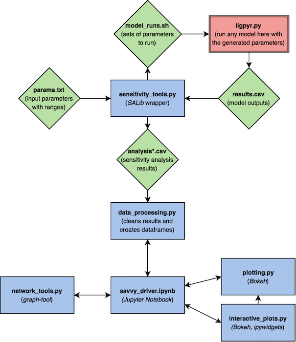

.. savvy documentation master file, created by
   sphinx-quickstart on Tue Mar 15 11:10:06 2016.
   You can adapt this file completely to your liking, but it should at least
   contain the root `toctree` directive.

Welcome to savvy's documentation!
=================================

Introduction
============

Do you savvy your sensitivity analysis results?  savvy is a data visualization
toolkit that provides interactive visualizations of the results from high
dimensionality global sensitivity analyses.  Users can visualize Sobol
sensitivity analysis results generated by `SALib <https://github.com/SALib/SALib>`_, or any data with the same structure (see the sample SALib output in the folder
``savvy/sample_data_files/`` for this structure).

For information on sensitivity analysis please see the SALib documentation.

savvy was written to visualize the total, first order, and second order
sensitivities of 30 outputs from a lignin pyrolysis model with 410 parameters
*(link to the lignin pyrolysis model will be added when that project is published)*.
Consequently, some functionality is specific to our model and is noted as such
in relevant docstrings, but overriding the default arguments in these functions
allows users to use any SALib output data from SALib.analyze.sobol.

Contents
========

.. toctree::
   :maxdepth: 2

   requirements
   getting-started
   module-docstrings

Package Structure
=================
savvy's architecture is shown below.  Blue rectangles are savvy modules; green
diamonds are input or output files; and the red rectangle is any black-box model
of your choice that can take a set of inputs and produce outputs you would like
to analyze.

Everything in the top half of this diagram, bounded by the green diamonds, is
the typical workflow for a standard sensitivity analysis using SALib, and can be
performed independently from savvy (using ``savvy.sensitivity_tools`` ensures
your files will be in the proper format to be visualized with savvy, but is not
required to use SALib).  Once you have your sensitivity analysis results, with
filenames that start with "analysis", you are ready to visualize with savvy.

Indices and tables
==================

* :ref:`genindex`
* :ref:`modindex`
* :ref:`search`
